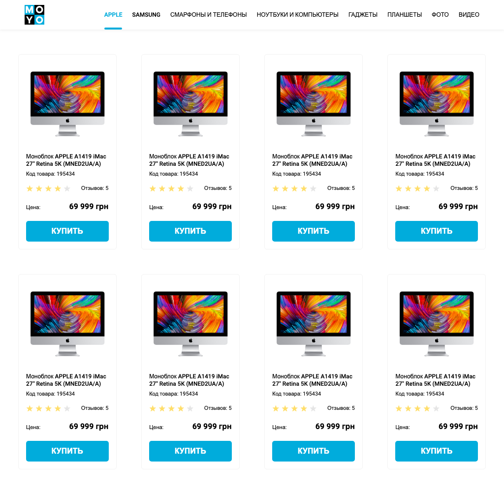

# Frontend practice with catalog page
Replace `<your_account>` with your Github username and copy the links to Pull Request description:
- [DEMO LINK](https://denyskleimenov.github.io/layout_catalog/)
- [TEST REPORT LINK](https://DenysKleimenov.github.io/layout_catalog/report/html_report/)

> Follow [this instruction](https://github.com/mate-academy/layout_task-guideline#how-to-solve-the-layout-tasks-on-github)
___
> Write styles in `src/styles/main.scss` instead of `src/style.css`.
___

## ❗️❗️❗️ DON'T FORGET TO PROOFREAD YOUR CODE WITH [CHECKLIST](https://github.com/mate-academy/layout_catalog/blob/master/checklist.md) BEFORE SENDING YOUR PULL REQUEST❗️❗️❗️

## The task
Create HTML page with catalog. Develop semantic page structure as shown on [the mockup](https://www.figma.com/file/ojkArVazq7vsX0nbpn9CxZ/Moyo-%2F-Catalog-(ENG)?node-id=32249%3A354).

## Requirements:
- use `Card` and `Header` blocks from previous tasks but rewrite them using BEM
and SCSS
- Nav links color is not `black` any more
- there should always be 4 cards in a row (not 2, 3 or 5)
  - use `:nth-child(4n)` to select every 4th element
  - use `:nth-last-child(-n + 4)` to select 4 last elements
- cards should have fixed width and fixed distances between them
- cards container should have fixed paddings (see 1024px example), bottom the same as top
- use semantic tags. `<header>`, `<nav>`, `<main>`
- add class `is-active` to the first link (`Apple`) in navigation
- remove old `data-qa` attributes
- add `data-qa="nav-hover"` (not just `hover`) to the 4th nav link for testing (`Laptops & computers`)
- add `data-qa="card"` to the first card
- add `data-qa="card-hover"` (not just `hover`) to the link `Buy` inside the first card
---
--> [CHECKLIST](https://github.com/mate-academy/layout_catalog/blob/master/checklist.md)
---

---
### Tips & Hints
Don't use flex `gap` property, it's not yet supported by tests.
